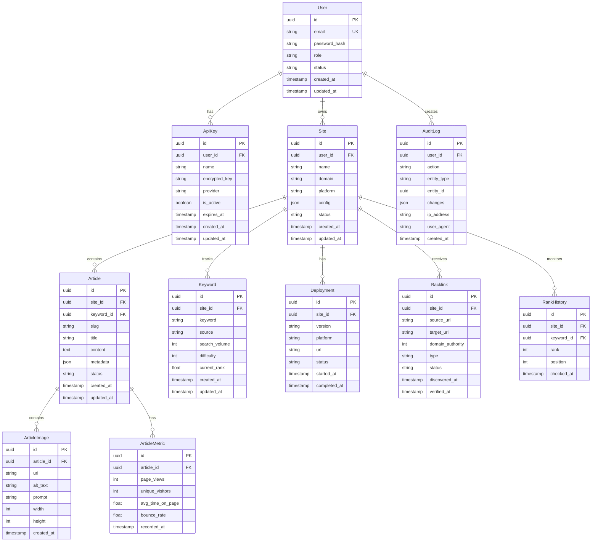

# 📊 AI-SEO-Mass-Engine 数据库设计文档
# Database Design Documentation

**版本 / Version**: 1.0.0
**日期 / Date**: 2026-01-18
**数据库 / Database**: PostgreSQL (推荐) / MongoDB (备选)

---

## 📋 目录 / Table of Contents

1. [概述 / Overview](#概述--overview)
2. [实体关系图 / ERD](#实体关系图--erd)
3. [表设计 / Table Design](#表设计--table-design)
4. [索引设计 / Index Design](#索引设计--index-design)
5. [安全设计 / Security Design](#安全设计--security-design)
6. [迁移策略 / Migration Strategy](#迁移策略--migration-strategy)
7. [性能优化与其他建议 / Performance Optimization](#性能优化与其他建议--performance-optimization)

---

## 概述 / Overview

### 设计原则 / Design Principles

- **规范化**: 第三范式 (3NF)
- **可扩展性**: 支持多租户、多语言、多站点
- **性能优化**: 合理使用索引、分区、缓存
- **数据安全**: 敏感数据加密、行级安全
- **审计追踪**: 关键操作记录

### 技术栈 / Tech Stack

| 技术 / Technology | 用途 / Purpose | 版本 / Version |
|------------------|----------------|----------------|
| PostgreSQL | 主数据库 | 15+ |
| MongoDB | 备选数据库 | 7+ |
| Prisma ORM | 数据库访问 | 5+ |
| Redis | 缓存 & 会话 | 7+ |

---

## 实体关系图 / ERD



---

## 表设计 / Table Design

### 1. Users 表 / 用户表

```sql
CREATE TABLE users (
    id UUID PRIMARY KEY DEFAULT gen_random_uuid(),
    email VARCHAR(255) UNIQUE NOT NULL,
    username VARCHAR(100) UNIQUE,
    password_hash VARCHAR(255) NOT NULL,
    full_name VARCHAR(100),
    role VARCHAR(20) DEFAULT 'user' CHECK (role IN ('admin', 'user', 'viewer')),
    status VARCHAR(20) DEFAULT 'active' CHECK (status IN ('active', 'inactive', 'suspended')),
    preferences JSONB DEFAULT '{}',
    last_login_at TIMESTAMP,
    created_at TIMESTAMP DEFAULT CURRENT_TIMESTAMP,
    updated_at TIMESTAMP DEFAULT CURRENT_TIMESTAMP,
    deleted_at TIMESTAMP
);

-- Indexes
CREATE INDEX idx_users_email ON users(email);
CREATE INDEX idx_users_status ON users(status);
CREATE INDEX idx_users_created_at ON users(created_at);

-- Triggers
CREATE TRIGGER update_users_updated_at
    BEFORE UPDATE ON users
    FOR EACH ROW EXECUTE FUNCTION update_updated_at_column();
```

**字段说明 / Field Description:**

| 字段 | 类型 | 说明 |
|------|------|------|
| id | UUID | 主键 |
| email | VARCHAR(255) | 邮箱，唯一 |
| username | VARCHAR(100) | 用户名，唯一 |
| password_hash | VARCHAR(255) | 密码哈希（bcrypt） |
| full_name | VARCHAR(100) | 全名 |
| role | VARCHAR(20) | 角色：admin/user/viewer |
| status | VARCHAR(20) | 状态：active/inactive/suspended |
| preferences | JSONB | 用户偏好设置 |
| last_login_at | TIMESTAMP | 最后登录时间 |
| created_at | TIMESTAMP | 创建时间 |
| updated_at | TIMESTAMP | 更新时间 |
| deleted_at | TIMESTAMP | 软删除时间 |

---

### 2. ApiKeys 表 / API 密钥表

```sql
CREATE TABLE api_keys (
    id UUID PRIMARY KEY DEFAULT gen_random_uuid(),
    user_id UUID NOT NULL REFERENCES users(id) ON DELETE CASCADE,
    name VARCHAR(100) NOT NULL,
    provider VARCHAR(50) NOT NULL,
    encrypted_key TEXT NOT NULL,
    is_active BOOLEAN DEFAULT true,
    expires_at TIMESTAMP,
    last_used_at TIMESTAMP,
    created_at TIMESTAMP DEFAULT CURRENT_TIMESTAMP,
    updated_at TIMESTAMP DEFAULT CURRENT_TIMESTAMP
);

-- Indexes
CREATE INDEX idx_api_keys_user_id ON api_keys(user_id);
CREATE INDEX idx_api_keys_provider ON api_keys(provider);
CREATE INDEX idx_api_keys_is_active ON api_keys(is_active);
```

**字段说明 / Field Description:**

| 字段 | 类型 | 说明 |
|------|------|------|
| id | UUID | 主键 |
| user_id | UUID | 用户 ID（外键） |
| name | VARCHAR(100) | 密钥名称 |
| provider | VARCHAR(50) | 提供商：anthropic/openai/gemini/等 |
| encrypted_key | TEXT | 加密后的密钥 |
| is_active | BOOLEAN | 是否激活 |
| expires_at | TIMESTAMP | 过期时间 |
| last_used_at | TIMESTAMP | 最后使用时间 |
| created_at | TIMESTAMP | 创建时间 |
| updated_at | TIMESTAMP | 更新时间 |

---

### 3. Sites 表 / 站点表

```sql
CREATE TABLE sites (
    id UUID PRIMARY KEY DEFAULT gen_random_uuid(),
    user_id UUID NOT NULL REFERENCES users(id) ON DELETE CASCADE,
    name VARCHAR(100) NOT NULL,
    domain VARCHAR(255) NOT NULL,
    description TEXT,
    platform VARCHAR(50) DEFAULT 'astro',
    config JSONB DEFAULT '{}',
    status VARCHAR(20) DEFAULT 'draft' CHECK (status IN ('draft', 'active', 'archived')),
    created_at TIMESTAMP DEFAULT CURRENT_TIMESTAMP,
    updated_at TIMESTAMP DEFAULT CURRENT_TIMESTAMP
);

-- Indexes
CREATE INDEX idx_sites_user_id ON sites(user_id);
CREATE INDEX idx_sites_domain ON sites(domain);
CREATE INDEX idx_sites_status ON sites(status);
```

**字段说明 / Field Description:**

| 字段 | 类型 | 说明 |
|------|------|------|
| id | UUID | 主键 |
| user_id | UUID | 用户 ID（外键） |
| name | VARCHAR(100) | 站点名称 |
| domain | VARCHAR(255) | 域名 |
| description | TEXT | 描述 |
| platform | VARCHAR(50) | 平台：astro/wordpress/等 |
| config | JSONB | 站点配置 |
| status | VARCHAR(20) | 状态：draft/active/archived |
| created_at | TIMESTAMP | 创建时间 |
| updated_at | TIMESTAMP | 更新时间 |

---

### 4. Keywords 表 / 关键词表

```sql
CREATE TABLE keywords (
    id UUID PRIMARY KEY DEFAULT gen_random_uuid(),
    site_id UUID NOT NULL REFERENCES sites(id) ON DELETE CASCADE,
    keyword VARCHAR(255) NOT NULL,
    source VARCHAR(50) DEFAULT 'auto',
    locale VARCHAR(10) DEFAULT 'en-US',
    search_volume INTEGER,
    difficulty INTEGER CHECK (difficulty BETWEEN 0 AND 100),
    current_rank INTEGER,
    target_rank INTEGER,
    status VARCHAR(20) DEFAULT 'pending' CHECK (status IN ('pending', 'generating', 'completed', 'failed')),
    created_at TIMESTAMP DEFAULT CURRENT_TIMESTAMP,
    updated_at TIMESTAMP DEFAULT CURRENT_TIMESTAMP,
    UNIQUE(site_id, keyword)
);

-- Indexes
CREATE INDEX idx_keywords_keywords_site_id ON keywords(site_id);
CREATE INDEX idx_keywords_keyword ON keywords(keyword);
CREATE INDEX idx_keywords_search_volume ON keywords(search_volume DESC);
CREATE INDEX idx_keywords_status ON keywords(status);
```

**字段说明 / Field Description:**

| 字段 | 类型 | 说明 |
|------|------|------|
| id | UUID | 主键 |
| site_id | UUID | 站点 ID（外键） |
| keyword | VARCHAR(255) | 关键词 |
| source | VARCHAR(50) | 来源：auto/manual/import |
| locale | VARCHAR(10) | 语言区域 |
| search_volume | INTEGER | 搜索量 |
| difficulty | INTEGER | 难度（0-100） |
| current_rank | INTEGER | 当前排名 |
| target_rank | INTEGER | 目标排名 |
| status | VARCHAR(20) | 状态：pending/generating/completed/failed |
| created_at | TIMESTAMP | 创建时间 |
| updated_at | TIMESTAMP | 更新时间 |

---

### 5. Articles 表 / 文章表

```sql
CREATE TABLE articles (
    id UUID UUID PRIMARY KEY DEFAULT gen_random_uuid(),
    site_id UUID NOT NULL REFERENCES sites(id) ON DELETE CASCADE,
    keyword_id UUID REFERENCES keywords(id) ON DELETE SET NULL,
    slug VARCHAR(255) NOT NULL,
    title VARCHAR(255) NOT NULL,
    content TEXT NOT NULL,
    excerpt TEXT,
    author_id UUID REFERENCES users(id),
    ai_model VARCHAR(50),
    metadata JSONB DEFAULT '{}',
    status VARCHAR(20) DEFAULT 'draft' CHECK (status IN ('draft', 'published', 'archived')),
    published_at TIMESTAMP,
    created_at TIMESTAMP DEFAULT CURRENT_TIMESTAMP,
    updated_at TIMESTAMP DEFAULT CURRENT_TIMESTAMP,
    UNIQUE(site_id, slug)
);

-- Indexes
CREATE INDEX idx_articles_site_id ON articles(site_id);
CREATE INDEX idx_articles_keyword_id ON articles(keyword_id);
CREATE INDEX idx_articles_slug ON articles(slug);
CREATE INDEX idx_articles_status ON articles(status);
CREATE INDEX idx_articles_published_at ON articles(published_at DESC);
CREATE INDEX idx_articles_metadata_gin ON articles USING GIN(metadata);
```

**字段说明 / Field Description:**

| 字段 | 类型 | 说明 |
|------|------|------|
| id | UUID | 主键 |
| site_id | UUID | 站点 ID（外键） |
| keyword_id | UUID | 关键词 ID（外键） |
| slug | VARCHAR(255) | URL slug |
| title | VARCHAR(255) | 标题 |
| content | TEXT | 内容 |
| excerpt | TEXT | |摘要 |
| author_id | UUID | 作者 ID |
| ai_model | VARCHAR(50) | AI 模型：claude/gpt4/gemini |
| metadata | JSONB | 元数据 |
| status | VARCHAR(20) | 状态：draft/published/archived |
| published_at | TIMESTAMP | 发布时间 |
| created_at | TIMESTAMP | 创建时间 |
| updated_at | TIMESTAMP | 更新时间 |

---

### 6. ArticleImages 表 / 文章图片表

```sql
CREATE TABLE article_images (
    id UUID PRIMARY KEY DEFAULT gen_random_uuid(),
    article_id UUID NOT NULL REFERENCES articles(id) ON DELETE CASCADE,
    url TEXT NOT NULL,
    alt_text VARCHAR(255),
    prompt TEXT,
    width INTEGER,
    height INTEGER,
    file_size INTEGER,
    storage_provider VARCHAR(50),
    created_at TIMESTAMP DEFAULT CURRENT_TIMESTAMP
);

-- Indexes
CREATE INDEX idx_article_images_article_id ON article_images(article_id);
```

---

### 7. ArticleMetrics 表 / 文章指标表

```sql
CREATE TABLE article_metrics (
    id UUID PRIMARY KEY DEFAULT gen_random_uuid(),
    article_id UUID NOT NULL REFERENCES articles(id) ON DELETE CASCADE,
    date DATE NOT NULL,
    page_views INTEGER DEFAULT 0,
    unique_visitors INTEGER DEFAULT 0,
    avg_time_on_page FLOAT,
    bounce_rate FLOAT,
    social_shares INTEGER DEFAULT 0,
    created_at TIMESTAMP DEFAULT CURRENT_TIMESTAMP,
    UNIQUE(article_id, date)
);

-- Indexes
CREATE INDEX idx_article_metrics_article_id ON article_metrics(article_id);
CREATE INDEX idx_article_metrics_date ON article_metrics(date DESC);
```

---

### 8. Deployments 表 / 部署表

```sql
CREATE TABLE deployments (
    id UUID PRIMARY KEY DEFAULT gen_random_uuid(),
    site_id UUID NOT NULL REFERENCES sites(id) ON DELETE CASCADE,
    version VARCHAR(50) NOT NULL,
    platform VARCHAR(50) NOT NULL,
    url TEXT,
    status VARCHAR(20) DEFAULT 'pending' CHECK (status IN ('pending', 'building', 'deploying', 'success', 'failed')),
    logs TEXT,
    started_at TIMESTAMP DEFAULT CURRENT_TIMESTAMP,
    completed_at TIMESTAMP,
    error_message TEXT
);

-- Indexes
CREATE INDEX idx_deployments_site_id ON deployments(site_id);
CREATE INDEX idx_deployments_status ON deployments(status);
CREATE INDEX idx_deployments_started_at ON deployments(started_at DESC);
```

---

### 9. Backlinks 表 / 反向链接表

```sql
CREATE TABLE backlinks (
    id UUID PRIMARY KEY DEFAULT gen_random_uuid(),
    site_id UUID NOT NULL REFERENCES sites(id) ON DELETE CASCADE,
    source_url TEXT NOT NULL,
    target_url TEXT NOT NULL,
    anchor_text VARCHAR(255),
    domain_authority INTEGER,
    page_authority INTEGER,
    type VARCHAR(50) DEFAULT 'natural' CHECK (type IN ('natural', 'outreach', 'guest', 'pbn')),
    status VARCHAR(20) DEFAULT 'pending' CHECK (status IN ('pending', 'active', 'lost', 'disavowed')),
    discovered_at TIMESTAMP DEFAULT CURRENT_TIMESTAMP,
    verified_at TIMESTAMP,
    last_checked_at TIMESTAMP
);

-- Indexes
CREATE INDEX idx_backlinks_site_id ON backlinks(site_id);
CREATE INDEX idx_backlinks_source_url ON backlinks(source_url);
CREATE INDEX idx_backlinks_status ON backlinks(status);
```

---

### 10. RankHistory 表 / 排名历史表

```sql
CREATE TABLE rank_history (
    id UUID PRIMARY KEY DEFAULT gen_random_uuid(),
    site_id UUID NOT NULL REFERENCES sites(id) ON DELETE CASCADE,
    keyword_id UUID NOT NULL REFERENCES keywords(id) ON DELETE CASCADE,
    rank INTEGER NOT NULL,
    position INTEGER,
    url TEXT,
    checked_at TIMESTAMP DEFAULT CURRENT_TIMESTAMP,
    UNIQUE(site_id, keyword_id, checked_at)
);

-- Indexes
CREATE INDEX idx_rank_history_site_id ON rank_history(site_id);
CREATE INDEX idx_rank_history_keyword_id ON rank_history(keyword_id);
CREATE INDEX idx_rank_history_checked_at ON rank_history(checked_at DESC);
```

---

### 11. AuditLog 表 / 审计日志表

```sql
CREATE TABLE audit_logs (
    id UUID PRIMARY KEY DEFAULT gen_random_uuid(),
    user_id UUID REFERENCES users(id) ON DELETE SET NULL,
    action VARCHAR(100) NOT NULL,
    entity_type VARCHAR(50) NOT NULL,
    entity_id UUID,
    changes JSONB,
    ip_address VARCHAR(45),
    user_agent TEXT,
    created_at TIMESTAMP DEFAULT CURRENT_TIMESTAMP
);

-- Indexes
CREATE INDEX idx_audit_logs_user_id ON audit_logs(user_id);
CREATE INDEX idx_audit_logs_action ON audit_logs(action);
CREATE INDEX idx_audit_logs_entity_type ON audit_logs(entity_type);
CREATE INDEX idx_audit_logs_created_at ON audit_logs(created_at DESC);

-- Partition by month for performance
CREATE TABLE audit_logs_y2025m01 PARTITION OF audit_logs
    FOR VALUES FROM ('2025-01-01') TO ('2025-02-01');
```

---

### 12. Jobs 表 / 任务表（异步队列）

```sql
CREATE TABLE jobs (
    id UUID PRIMARY KEY DEFAULT gen_random_uuid(),
    type VARCHAR(50) NOT NULL,
    payload JSONB NOT NULL,
    status VARCHAR(20) DEFAULT 'pending' CHECK (status IN ('pending', 'running', 'completed', 'failed')),
    priority INTEGER DEFAULT 0,
    max_retries INTEGER DEFAULT 3,
    retry_count INTEGER DEFAULT 0,
    error_message TEXT,
    started_at TIMESTAMP,
    completed_at TIMESTAMP,
    created_at TIMESTAMP DEFAULT CURRENT_TIMESTAMP
);

-- Indexes
CREATE INDEX idx_jobs_status ON jobs(status);
CREATE INDEX idx_jobs_priority ON jobs(priority DESC, created_at ASC);
CREATE INDEX idx_jobs_type ON jobs(type);
```

---

## 索引设计 / Index Design

### B-Tree 索引（默认）

```sql
-- 外键索引
CREATE INDEX idx_fk_api_keys_user_id ON api_keys(user_id);
CREATE INDEX idx_fk_sites_user_id ON sites(user_id);
CREATE INDEX idx_fk_keywords_site_id ON keywords(site_id);
CREATE INDEX idx_fk_articles_site_id ON articles(site_id);
CREATE INDEX idx_fk_articles_keyword_id ON articles(keyword_id);

-- 查询优化索引
CREATE INDEX idx_users_email ON users(email);
CREATE INDEX idx_sites_domain ON sites(domain);
CREATE INDEX idx_articles_slug ON articles(slug);
CREATE INDEX idx_keywordsrankings_keyword ON keywords(keyword);
CREATE INDEX idx_rank_history_checked_at ON rank_history(checked_at DESC);
```

### GIN 索引（JSON 查询）

```sql
-- JSONB 字段索引
CREATE INDEX idx_articles_metadata ON articles USING GIN(metadata);
CREATE INDEX idx_sites_config ON sites USING GIN(config);
CREATE INDEX idx_audit_logs_changes ON audit_logs USING GIN(changes);
CREATE INDEX idx_jobs_payload ON jobs USING GIN(payload);
```

### 部分索引（条件索引）

```sql
-- 仅索引活跃记录
CREATE INDEX idx_active_api_keys ON api_keys(user_id, provider)
    WHERE is_active = true;

CREATE INDEX idx_published_articles ON articles(site_id, published_at DESC)
    WHERE status = 'published';

CREATE INDEX idx_active_sites ON sites(user_id, created_at DESC)
    WHERE status = 'active';
```

### 复合索引

```sql
-- 多字段组合查询
CREATE INDEX idx_articles_site_status_date ON articles(site_id, status, published_at DESC);
CREATE INDEX idx_keywords_site_difficulty ON keywords(site_id, difficulty DESC, search_volume DESC);
CREATE INDEX idx_rank_history_keyword_date ON rank_history(keyword_id, checked_at DESC);
```

---

## 安全设计 / Security Design

### 1. Row Level Security (RLS)

```sql
-- Enable RLS on sensitive tables
ALTER TABLE api_keys_keys ENABLE ROW LEVEL SECURITY;
ALTER TABLE users ENABLE ROW LEVEL SECURITY;

-- Policy: Users can only access their own API keys
CREATE POLICY api_keys_isolation ON api_keys
    USING (user_id = current_user_id());

-- Policy: Users can only access their own data
CREATE POLICY users_isolation ON users
    USING (id = current_user_id() OR is_admin());
```

### 2. 数据加密

**加密敏感字段：**

```sql
-- 使用 pgcrypto 扩展
CREATE EXTENSION IF NOT EXISTS pgcrypto;

-- 加密函数
CREATE OR REPLACE FUNCTION encrypt_api_key(key TEXT)
RETURNS TEXT AS $$
    SELECT encode(encrypt(key::bytea, get_encryption_key(), 'aes'), 'hex');
$$ LANGUAGE SQL SECURITY DEFINER;

-- 解密函数
CREATE OR REPLACE FUNCTION decrypt_api_key(encrypted_key TEXT)
RETURNS TEXT AS $$
    SELECT convert_from(decrypt(decode(encrypted_key, 'hex'), get_encryption_key(), 'aes'), 'UTF8');
$$ LANGUAGE SQL SECURITY DEFINER;
```

### 3. 审计触发器

```sql
-- 审计触发器函数
CREATE OR REPLACE FUNCTION audit_trigger()
RETURNS TRIGGER AS $$
BEGIN
    INSERT INTO audit_logs (
        user_id,
        action,
        entity_type,
        entity_id,
        changes,
        ip_address
    ) VALUES (
        current_user_id(),
        TG_OP,
        TG_TABLE_NAME,
        NEW.id,
        jsonb_build_object('old', OLD, 'new', NEW),
        inet_client_addr()
    );
    RETURN NEW;
END;
$$ LANGUAGE plpgsql SECURITY DEFINER;

-- 为关键表添加审计触发器
CREATE TRIGGER audit_users_changes
    AFTER INSERT OR UPDATE OR DELETE ON users
    FOR EACH ROW EXECUTE FUNCTION audit_trigger();

CREATE TRIGGER audit_api_keys_changes
    AFTER INSERT OR UPDATE OR DELETE ON api_keys
    FOR EACH ROW EXECUTE FUNCTION audit_trigger();
```

---

## 迁移策略 / Migration Strategy

### 版本控制

```
migrations/
├── 001_initial_schema.sql
├── 002_add_indexes.sql
├── 003_add_jobs_table.sql
├── 004_add_audit_logging.sql
├── 005_enable_rls.sql
└── 006_add_partitions.sql
```

### 迁移执行

```bash
# 创建迁移
pnpm prisma migrate dev --name add_jobs_table

# 部署迁移
pnpm prisma migrate deploy

# 重置数据库（开发环境）
pnpm prisma migrate reset
```

### 数据备份策略

```bash
# 每日完整备份
pg_dump -F c -f backup_$(date +%Y%m%d).db ai_seo_engine

# 持续归档（WAL）
archive_mode = on
archive_command = 'cp %p /archive/%f'
```

---

## 性能优化与其他建议 / Performance Optimization

### 1. 连接池配置

```javascript
// Prisma 数据源配置
datasource db {
  provider = "postgresql"
  url      = env("DATABASE_URL")
  pool_timeout = 30
  connection_limit = 10
}
```

### 2. 查询优化建议

```sql
-- 使用 EXPLAIN ANALYZE 分析查询
EXPLAIN ANALYZE
SELECT * FROM articles
WHERE site_id = '...' AND status = 'published'
ORDER BY published_at DESC
LIMIT 20;

-- 使用物化视图加速聚合查询
CREATE MATERIALIZED VIEW site_stats AS
SELECT
    s.id,
    s.name,
    COUNT(DISTINCT a.id) as article_count,
    SUM(a.page_views) as total_views
FROM sites s
LEFT JOIN articles a ON s.id = a.site_id
GROUP BY s.id, s.name;

-- 定期刷新物化视图
REFRESH MATERIALIZED VIEW CONCURRENTLY site_stats;
```

### 3. 分区策略

```sql
-- 按月分区 audit_logs
CREATE TABLE audit_logs (
    id UUID,
    user_id UUID,
    action VARCHAR(100),
    created_at TIMESTAMP
) PARTITION BY RANGE (created_at);

-- 自动创建分区
CREATE FUNCTION create_partition_if_needed()
RETURNS void AS $$
DECLARE
    partition_name text;
    start_date date;
    end_date_date;
BEGIN
    -- 创建下个月的分区

end;
$$ LANGUAGE plpgsql;
```

### 4. 缓存策略

```javascript
// Redis 缓存文章内容
const cacheArticle = async (articleId: string, data: Article) => {
  await redis.setex(
    `article:${articleId}`,
    3600, // 1 hour
    JSON.stringify(data)
  );
};

// 缓存排名查询结果
const cacheRankings = async (siteId: string, data: Rank[]) => {
  await redis.setex(
    `rankings:${siteId}`,
    1800, // 30 minutes
    JSON.stringify(data)
  );
};
```

### 5. 定期维护

```sql
-- 定期清理旧日志
DELETE FROM audit_logs
WHERE created_at < NOW() - INTERVAL '6 months';

-- 定期清理失败的作业
DELETE FROM jobs
WHERE status = 'failed' AND created_at < NOW() - INTERVAL '30 days';

-- 重建索引
REINDEX TABLE CONCURRENTLY articles;
REINDEX TABLE CONCURRENTLY keywords;

-- 更新统计信息
ANALYZE articles;
ANALYZE keywords;
```

---

## Prisma Schema 示例

```prisma
// prisma/schema.prisma

datasource db {
  provider = "postgresql"
  url      = env("DATABASE_URL")
}

generator client {
  provider = "prisma-client-js"
  previewFeatures = ["fullTextSearch", "fullTextIndex"]
}

model User {
  id            String    @id @default(uuid())
  email         String    @unique
  username      String?   @unique
  passwordHash  String
  fullName      String?
  role          Role      @default(USER)
  status        Status    @default(ACTIVE)
  preferences   Json?
  lastLoginAt   DateTime?
  createdAt     DateTime  @default(now())
  updatedAt     DateTime  @updatedAt

  apiKeys       ApiKey[]
  sites         Site[]
  auditLogs     AuditLog[]
  articles      Article[] @relation("AuthoredArticles")
}

enum Role {
  ADMIN
  USER
  VIEWER
}

enum Status {
  ACTIVE
  INACTIVE
  SUSPENDED
}

model ApiKey {
  id           String      @id @default(uuid())
  userId       String
  name         String
  provider     Provider
  encryptedKey String
  isActive     Boolean     @default(true)
  expiresAt    DateTime?
  lastUsedAt   DateTime?
  createdAt    DateTime    @default(now())
  updatedAt    DateTime    @updatedAt

  user         User        @relation(fields: [userId], references: [id], onDelete: Cascade)
}

enum Provider {
  ANTHROPIC
  OPENAI
  GEMINI
  SENDGRID
  CLOUDFLARE
}

model Site {
  id          String       @id @default(uuid())
  userId      String
  name        String
  domain      String
  description String?
  platform    Platform      @default(ASTRO)
  config      Json?
  status      SiteStatus   @default(DRAFT)
  createdAt   DateTime     @default(now())
  updatedAt   DateTime     @updatedAt

  user        User         @relation(fields: [userId], references: [id], onDelete: Cascade)
  articles    Article[]
  keywords    Keyword[]
  deployments Deployment[]
  backlinks   Backlink[]
  rankings    RankHistory[]
}

enum Platform {
  ASTRO
  WORDPRESS
  NEXTJS
}

enum SiteStatus {
  DRAFT
  ACTIVE
  ARCHIVED
}

model Keyword {
  id            String        @id @default(uuid())
  siteId        String
  keyword       String
  source        KeywordSource @default(AUTO)
  locale        String        @default("en-US")
  searchVolume  Int?
  difficulty    Int?
  currentRank   Int?
  targetRank    Int?
  status        KeywordStatus @default(PENDING)
  createdAt     DateTime      @default(now())
  updatedAt     DateTime      @updatedAt

  site          Site          @relation(fields: [siteId], references: [id], onDelete: Cascade)
  articles      Article[]
  rankHistory    RankHistory[]

  @@unique([siteId, keyword])
}

enum KeywordSource {
  AUTO
  MANUAL
  IMPORT
}

enum KeywordStatus {
  PENDING
  GENERATING
  COMPLETED
  FAILED
}

model Article {
  id          String        @id @default(uuid())
  siteId      String
  keywordId   String?
  slug        String
  title       String
  content     String          @db.Text
  excerpt     String?
  authorId    String?
  aiModel     AiModel?
  metadata    Json?
  status      ArticleStatus @default(DRAFT)
  publishedAt DateTime?
  createdAt   DateTime      @default(now())
  updatedAt   DateTime      @updatedAt

  site        Site          @relation(fields: [siteId], references: [id], onDelete: Cascade)
  keyword     Keyword?      @relation(fields: [keywordId], references: [id], onDelete: SetNull)
  author      User?         @relation("AuthoredArticles", fields: [authorId], references: [id])
  images      ArticleImage[]
  metrics     ArticleMetric[]

  @@unique([siteId, slug])
}

enum AiModel {
  CLAUDE
  GPT4
  GEMINI
}

enum ArticleStatus {
  DRAFT
  PUBLISHED
  ARCHIVED
}

model ArticleImage {
  id             String  @id @default(uuid())
  articleId      String
  url            String
  altText        String?
  prompt         String?
  width          Int?
  height         Int?
  fileSize       Int?
  storageProvider String?
  createdAt      DateTime @default(now())

  article        Article @relation(fields: [articleId], references: [id], onDelete: Cascade)
}

model ArticleMetric {
  id               String   @id @default(uuid())
  articleId        String
  date             DateTime @db.Date
  pageViews        Int      @default(0)
  uniqueVisitors   Int      @default(0)
  avgTimeOnPage    Float?
  bounceRate       Float?
  socialShares     Int      @default(0)
  createdAt        DateTime @default(now())

  article          Article  @relation(fields: [articleId], references: [id], onDelete: Cascade)

  @@unique([articleId, date])
}

model Deployment {
  id            String           @id @default(uuid())
  siteId        String
  version       String
  platform      DeploymentPlatform
  url           String?
  status        DeploymentStatus @default(PENDING)
  logs          String?          @db.Text
  startedAt     DateTime         @default(now())
  completedAt   DateTime?
  errorMessage  String?

  site          Site             @relation(fields: [siteId], references: [id], onDelete: Cascade)
}

enum DeploymentPlatform {
  CLOUDFLARE
  VERCEL
  NETLIFY
  AMPLIFY
}

enum DeploymentStatus {
  PENDING
  BUILDING
  DEPLOYING
  SUCCESS
  FAILED
}

model Backlink {
  id              String        @id @default(uuid())
  siteId          String
  sourceUrl       String
  targetUrl       String
  anchorText      String?
  domainAuthority Int?
  pageAuthority   Int?
  type            BacklinkType  @default(NATURAL)
  status          BacklinkStatus @default(PENDING)
  discoveredAt    DateTime      @default(now())
  verifiedAt      DateTime?
  lastCheckedAt   DateTime?

  site            Site          @relation(fields: [siteId], references: [id], onDelete: Cascade)
}

enum BacklinkType {
  NATURAL
  OUTREACH
  GUEST
  PBN
}

enum BacklinkStatus {
  PENDING
  ACTIVE
  LOST
  DISAVOWED
}

model RankHistory {
  id         String   @id @default(uuid())
  siteId     String
  keywordId  String
  rank       Int
  position   Int?
  url        String?
  checkedAt  DateTime @default(now())

  site       Site     @relation(fields: [siteId], references: [id], onDelete: Cascade)
  keyword    Keyword  @relation(fields: [keywordId], references: [id], onDelete: Cascade)

  @@unique([siteId, keywordId, checkedAt])
}

model AuditLog {
  id          String   @id @default(uuid())
  userId      String?
  action      String
  entityType  String
  entityId    String?
  changes     Json?
  ipAddress   String?
  userAgent   String?   @db.Text
  createdAt   DateTime @default(now())

  user        User?    @relation(fields: [userId], references: [id], onDelete: SetNull)
}

model Job {
  id            String     @id @default(uuid())
  type          JobType
  payload       Json
  status        JobStatus  @default(PENDING)
  priority      Int        @default(0)
  maxRetries    Int        @default(3)
  retryCount    Int        @default(0)
  errorMessage  String?
  startedAt     DateTime?
  completedAt   DateTime?
  createdAt     DateTime   @default(now())
}

enum JobType {
  ARTICLE_GENERATION
  DEPLOYMENT
  RANK_CHECK
  SITEMAP_SUBMIT
  EMAIL_CAMPAIGN
}

enum JobStatus {
  PENDING
  RUNNING
  COMPLETED
  FAILED
}
```

---

## 总结 / Summary

本文档提供了 AI-SEO-Mass-Engine 的完整数据库设计，包括：

- ✅ 12 个核心数据表
- ✅ 完整的索引设计策略
- ✅ 行级安全 (RLS) 配置
- ✅ 数据加密方案
- ✅ 审计日志系统
- ✅ 迁移策略
- ✅ 性能优化建议
- ✅ Prisma Schema 定义

---

**文档版本**: 1.0.0
**最后更新**: 2026-01-18
