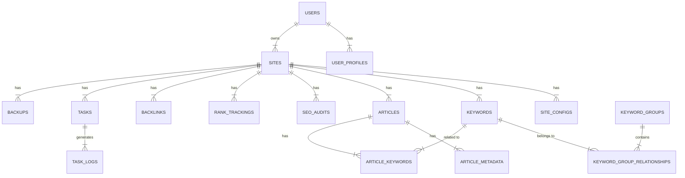

# 🗄️ AI-SEO-Mass-Engine 数据库设计文档

**版本**: v1.0
**创建日期**: 2026-01-18
**作者**: AI SEO System

---

## 📋 概述

本系统使用 **PostgreSQL** 作为主要数据库（推荐生产环境），**SQLite** 作为开发环境备选方案。

### 数据库架构原则

- **规范化设计**：遵循 3NF（第三范式）原则
- **类型安全**：使用 Prisma ORM 进行类型安全操作
- **性能优化**：关键查询添加索引
- **扩展性**：支持水平和垂直扩展

---

## 🗂️ 数据库结构

### 1. 用户管理表

#### 1.1 users - 用户表
```sql
CREATE TABLE users (
  id SERIAL PRIMARY KEY,
  username VARCHAR(50) UNIQUE NOT NULL,
  email VARCHAR(100) UNIQUE NOT NULL,
  password_hash VARCHAR(255) NOT NULL,
  display_name VARCHAR(100),
  avatar_url TEXT,
  role VARCHAR(20) DEFAULT 'user',
  status VARCHAR(20) DEFAULT 'active',
  created_at TIMESTAMPTZ DEFAULT NOW(),
  updated_at TIMESTAMPTZ DEFAULT NOW()
);
```

#### 1.2 user_profiles - 用户详情表
```sql
CREATE TABLE user_profiles (
  id SERIAL PRIMARY KEY,
  user_id INTEGER UNIQUE REFERENCES users(id),
  bio TEXT,
  website TEXT,
  company VARCHAR(100),
  location VARCHAR(100),
  timezone VARCHAR(50),
  preferences JSONB,
  created_at TIMESTAMPTZ DEFAULT NOW(),
  updated_at TIMESTAMPTZ DEFAULT NOW()
);
```

---

### 2. 站点管理表

#### 2.1 sites - 站点表
```sql
CREATE TABLE sites (
  id SERIAL PRIMARY KEY,
  user_id INTEGER REFERENCES users(id),
  domain VARCHAR(255) UNIQUE NOT NULL,
  name VARCHAR(255) NOT NULL,
  description TEXT,
  status VARCHAR(20) DEFAULT 'active',
  is_verified BOOLEAN DEFAULT FALSE,
  created_at TIMESTAMPTZ DEFAULT NOW(),
  updated_at TIMESTAMPTZ DEFAULT NOW()
);
```

#### 2.2 site_configs - 站点配置表
```sql
CREATE TABLE site_configs (
  id SERIAL PRIMARY KEY,
  site_id INTEGER UNIQUE REFERENCES sites(id),
  seo_settings JSONB,
  deployment_settings JSONB,
  analytics_settings JSONB,
  social_settings JSONB,
  created_at TIMESTAMPTZ DEFAULT NOW(),
  updated_at TIMESTAMPTZ DEFAULT NOW()
);
```

---

### 3. 关键词管理表

#### 3.1 keywords - 关键词表
```sql
CREATE TABLE keywords (
  id SERIAL PRIMARY KEY,
  site_id INTEGER REFERENCES sites(id),
  keyword TEXT NOT NULL,
  search_volume INTEGER,
  competition DECIMAL(3,2),
  difficulty DECIMAL(3,2),
  cost_per_click DECIMAL(10,2),
  cpc CURRENCY,
  trend JSONB,
  status VARCHAR(20) DEFAULT 'active',
  created_at TIMESTAMPTZ DEFAULT NOW(),
  updated_at TIMESTAMPTZ DEFAULT NOW()
);
```

#### 3.2 keyword_groups - 关键词分组表
```sql
CREATE TABLE keyword_groups (
  id SERIAL PRIMARY KEY,
  site_id INTEGER REFERENCES sites(id),
  name VARCHAR(100) NOT NULL,
  description TEXT,
  created_at TIMESTAMPTZ DEFAULT NOW(),
  updated_at TIMESTAMPTZ DEFAULT NOW()
);
```

#### 3.3 keyword_group_relationships - 关键词分组关系表
```sql
CREATE TABLE keyword_group_relationships (
  id SERIAL PRIMARY KEY,
  keyword_id INTEGER REFERENCES keywords(id),
  group_id INTEGER REFERENCES keyword_groups(id),
  created_at TIMESTAMPTZ DEFAULT NOW()
);
```

---

### 4. 文章管理表

#### 4.1 articles - 文章表
```sql
CREATE TABLE articles (
  id SERIAL PRIMARY KEY,
  site_id INTEGER REFERENCES sites(id),
  title VARCHAR(255) NOT NULL,
  slug TEXT UNIQUE NOT NULL,
  content TEXT NOT NULL,
  status VARCHAR(20) DEFAULT 'draft',
  word_count INTEGER,
  seo_score DECIMAL(3,2),
  created_at TIMESTAMPTZ DEFAULT NOW(),
  updated_at TIMESTAMPTZ DEFAULT NOW()
);
```

#### 4.2 article_metadata - 文章元数据表
```sql
CREATE TABLE article_metadata (
  id SERIAL PRIMARY KEY,
  article_id INTEGER UNIQUE REFERENCES articles(id),
  meta_title VARCHAR(255),
  meta_description TEXT,
  keywords TEXT,
  category VARCHAR(100),
  tags TEXT[],
  reading_time INTEGER,
  featured_image TEXT
);
```

#### 4.3 article_keywords - 文章关键词关系表
```sql
CREATE TABLE article_keywords (
  id SERIAL PRIMARY KEY,
  article_id INTEGER REFERENCES articles(id),
  keyword_id INTEGER REFERENCES keywords(id),
  importance VARCHAR(20) DEFAULT 'medium',
  created_at TIMESTAMPTZ DEFAULT NOW()
);
```

---

### 5. SEO 数据与分析表

#### 5.1 seo_audits - SEO 审计表
```sql
CREATE TABLE seo_audits (
  id SERIAL PRIMARY KEY,
  site_id INTEGER REFERENCES sites(id),
  score DECIMAL(3,2),
  technical_score DECIMAL(3,2),
  content_score DECIMAL(3,2),
  performance_score DECIMAL(3,2),
  accessibility_score DECIMAL(3,2),
  issues JSONB,
  recommendations JSONB,
  status VARCHAR(20) DEFAULT 'completed',
  created_at TIMESTAMPTZ DEFAULT NOW()
);
```

#### 5.2 rank_trackings - 排名跟踪表
```sql
CREATE TABLE rank_trackings (
  id SERIAL PRIMARY KEY,
  site_id INTEGER REFERENCES sites(id),
  keyword_id INTEGER REFERENCES keywords(id),
  rank INTEGER,
  position_change INTEGER,
  serp_features TEXT[],
  competitor_urls TEXT[],
  date TIMESTAMPTZ DEFAULT NOW()
);
```

#### 5.3 backlinks - 反向链接表
```sql
CREATE TABLE backlinks (
  id SERIAL PRIMARY KEY,
  site_id INTEGER REFERENCES sites(id),
  source_url TEXT,
  target_url TEXT,
  anchor_text TEXT,
  rel TEXT,
  domain_authority DECIMAL(3,2),
  page_authority DECIMAL(3,2),
  status VARCHAR(20) DEFAULT 'active',
  created_at TIMESTAMPTZ DEFAULT NOW(),
  updated_at TIMESTAMPTZ DEFAULT NOW()
);
```

---

### 6. 任务与作业表

#### 6.1 tasks - 任务表
```sql
CREATE TABLE tasks (
  id SERIAL PRIMARY KEY,
  user_id INTEGER REFERENCES users(id),
  site_id INTEGER REFERENCES sites(id),
  type VARCHAR(50) NOT NULL,
  status VARCHAR(20) DEFAULT 'pending',
  priority VARCHAR(20) DEFAULT 'medium',
  progress INTEGER DEFAULT 0,
  error_message TEXT,
  started_at TIMESTAMPTZ,
  completed_at TIMESTAMPTZ,
  created_at TIMESTAMPTZ DEFAULT NOW(),
  updated_at TIMESTAMPTZ DEFAULT NOW()
);
```

#### 6.2 task_logs - 任务日志表
```sql
CREATE TABLE task_logs (
  id SERIAL PRIMARY KEY,
  task_id INTEGER REFERENCES tasks(id),
  level VARCHAR(20) DEFAULT 'info',
  message TEXT,
  metadata JSONB,
  timestamp TIMESTAMPTZ DEFAULT NOW()
);
```

---

### 7. 数据同步与备份表

#### 7.1 backups - 备份表
```sql
CREATE TABLE backups (
  id SERIAL PRIMARY KEY,
  site_id INTEGER REFERENCES sites(id),
  type VARCHAR(50) NOT NULL,
  size INTEGER,
  path TEXT,
  status VARCHAR(20) DEFAULT 'completed',
  created_at TIMESTAMPTZ DEFAULT NOW()
);
```

---

### 8. 配置与设置表

#### 8.1 system_settings - 系统设置表
```sql
CREATE TABLE system_settings (
  id SERIAL PRIMARY KEY,
  key VARCHAR(100) UNIQUE NOT NULL,
  value JSONB,
  category VARCHAR(50) DEFAULT 'general',
  created_at TIMESTAMPTZ DEFAULT NOW(),
  updated_at TIMESTAMPTZ DEFAULT NOW()
);
```

---

## 🔍 索引优化

### 关键索引创建

```sql
-- 用户表索引
CREATE INDEX idx_users_email ON users(email);
CREATE INDEX idx_users_username ON users(username);
CREATE INDEX idx_users_status ON users(status);

-- 站点表索引
CREATE INDEX idx_sites_domain ON sites(domain);
CREATE INDEX idx_sites_user_id ON sites(user_id);
CREATE INDEX idx_sites_status ON sites(status);

-- 关键词表索引
CREATE INDEX idx_keywords_site_id ON keywords(site_id);
CREATE INDEX idx_keywords_keyword ON keywords(keyword);
CREATE INDEX idx_keywords_status ON keywords(status);
CREATE INDEX idx_keywords_search_volume ON keywords(search_volume DESC);
CREATE INDEX idx_keywords_difficulty ON keywords(difficulty);

-- 文章表索引
CREATE INDEX idx_articles_site_id ON articles(site_id);
CREATE INDEX idx_articles_status ON articles(status);
CREATE INDEX idx_articles_slug ON articles(slug);

-- 关键词分组关系索引
CREATE INDEX idx_keyword_group_relationships_group_id ON keyword_group_relationships(group_id);
CREATE INDEX idx_keyword_group_relationships_keyword_id ON keyword_group_relationships(keyword_id);

-- 排名跟踪索引
CREATE INDEX idx_rank_trackings_site_id ON rank_trackings(site_id);
CREATE INDEX idx_rank_trackings_keyword_id ON rank_trackings(keyword_id);
CREATE INDEX idx_rank_trackings_date ON rank_trackings(date DESC);

-- 反向链接索引
CREATE INDEX idx_backlinks_site_id ON backlinks(site_id);
CREATE INDEX idx_backlinks_source_url ON backlinks(source_url);
CREATE INDEX idx_backlinks_target_url ON backlinks(target_url);

-- 任务表索引
CREATE INDEX idx_tasks_user_id ON tasks(user_id);
CREATE INDEX idx_tasks_site_id ON tasks(site_id);
CREATE INDEX idx_tasks_status ON tasks(status);
CREATE INDEX idx_tasks_priority ON tasks(priority);

-- 任务日志索引
CREATE INDEX idx_task_logs_task_id ON task_logs(task_id);
CREATE INDEX idx_task_logs_level ON task_logs(level);
CREATE INDEX idx_task_logs_timestamp ON task_logs(timestamp DESC);
```

---

## 🔄 数据关系图



---

## 📈 查询优化建议

### 1. 常用查询优化

#### 获取站点关键词统计
```sql
SELECT
    COUNT(*) as total_keywords,
    AVG(search_volume) as avg_volume,
    MIN(difficulty) as min_difficulty,
    MAX(difficulty) as max_difficulty
FROM keywords
WHERE site_id = 123
AND status = 'active';
```

#### 获取最新排名数据
```sql
SELECT DISTINCT ON (keyword_id)
    keyword_id, rank, date
FROM rank_trackings
WHERE site_id = 123
ORDER BY keyword_id, date DESC;
```

---

### 2. 分页查询优化

```sql
-- 使用游标的分页方式（比 OFFSET 更高效）
SELECT *
FROM keywords
WHERE site_id = 123
AND id > 100
ORDER BY id ASC
LIMIT 20;
```

---

## 🔒 安全考虑

### 数据加密
- 用户密码使用 bcrypt 加密存储
- 敏感配置使用 AES-256 加密
- 传输使用 HTTPS

### 访问控制
- 基于角色的访问控制（RBAC）
- 每行级别的权限控制
- API 密钥加密存储

---

## 📊 性能优化建议

### 1. 连接池配置
```yaml
# PostgreSQL 连接池配置
max_connections: 100
pool_size: 20
idle_timeout: 30000
```

### 2. 查询缓存
- 关键词和排名数据使用 Redis 缓存
- 常用查询结果使用 Redis 存储

---

## 🚀 部署建议

### 开发环境
```yaml
# 使用 SQLite
database:
  url: "file:./dev.db"
  pool_size: 5
```

### 生产环境
```yaml
# 使用 PostgreSQL
database:
  url: "postgresql://user:password@db:5432/ai_seo_engine"
  pool_size: 20
  ssl: true
```

---

## 📝 迁移计划

### 阶段 1（基础架构）
1. 创建用户和站点管理表
2. 设置基础索引
3. 配置连接池

### 阶段 2（内容管理）
1. 创建文章和关键词表
2. 设置复合索引
3. 配置全文搜索

### 阶段 3（SEO 数据）
1. 创建审计和排名跟踪表
2. 设置分区表
3. 优化历史数据查询

---

## 🔄 备份策略

### 每日备份
```sql
# 自动备份脚本
BACKUP_DIR="/var/backups/ai-seo-engine"
DATE=$(date +"%Y%m%d")
pg_dump -U username ai_seo_engine > "$BACKUP_DIR/ai-seo-engine-$DATE.sql"
gzip "$BACKUP_DIR/ai-seo-engine-$DATE.sql"
```

### 增量备份
使用 PostgreSQL 的 `WAL` 日志进行增量备份。

---

## 📚 相关资源

- [Prisma ORM 文档](https://www.prisma.io/docs)
- [PostgreSQL 官方文档](https://www.postgresql.org/docs/)
- [PostgreSQL 性能优化](https://www.postgresql.org/docs/current/query-performance.html)

---

## 🔍 维护建议

### 定期检查
- 监控慢查询日志
- 检查索引使用情况
- 优化查询性能

### 数据清理
- 定期清理旧的任务日志
- 删除无效的关键词
- 归档历史排名数据

---

**文档版本**: v1.0
**最后更新**: 2026-01-18
